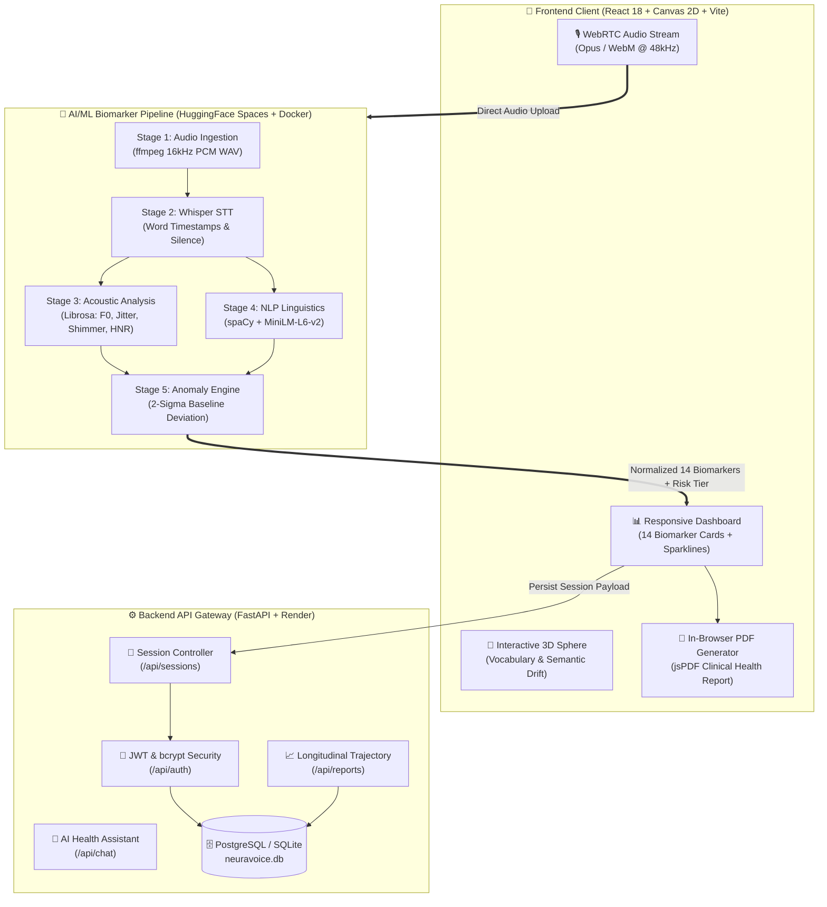
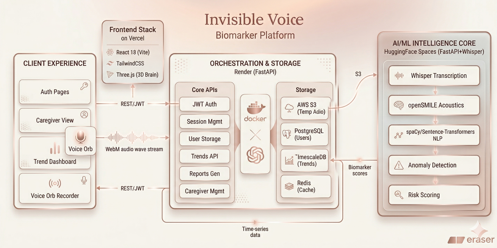
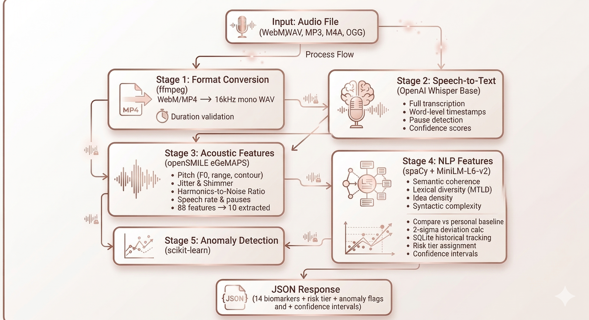
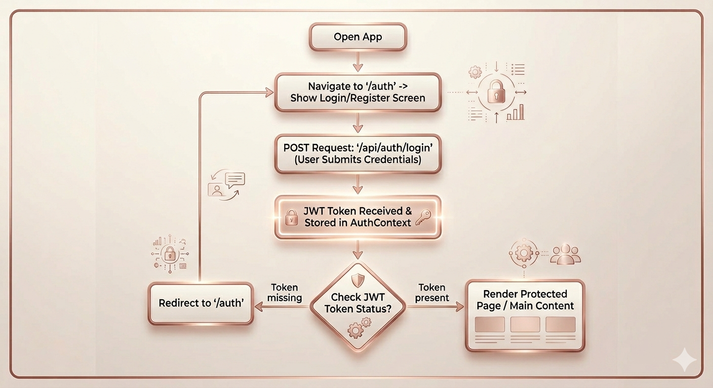
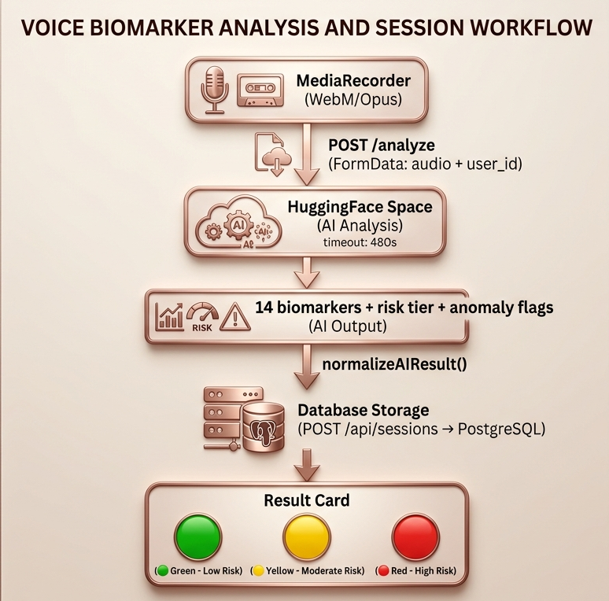
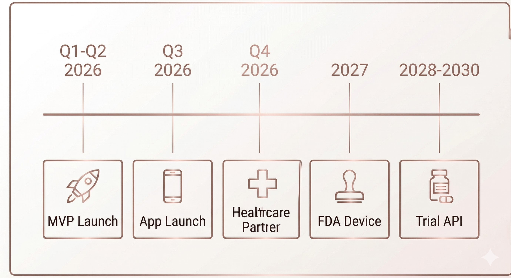

<div align="center">

```
   _  __                     _   __      _          
  / |/ /__ __ ________ _    | | / /___  (_)______  
 /    / -_) // / __/ _ `/   | |/ / _  \/ / __/ -_) 
/_/|_/\__/\_,_/_/  \_,_/    |___/\___//_/\__/\__/  
```

### **Clinical-Grade AI Voice Biomarker Intelligence Platform**
*Detect subtle linguistic and acoustic changes 18 months before clinical onset — using just your voice.*

<br/>

[](https://alamfarzann-cognisafe-ml.hf.space/health)
[](https://fastapi.tiangolo.com)
[](https://react.dev)
[](https://python.org)
[](LICENSE)

<br/>

[ 🤖 **HuggingFace Space** ](https://alamfarzann-cognisafe-ml.hf.space) &nbsp;•&nbsp;
[ ⚡ **Quick Start** ](#-quick-start--developer-guide) &nbsp;•&nbsp;
[ 🧬 **Biomarker Engine** ](#-the-14-clinical-biomarkers) &nbsp;•&nbsp;
[ 🏗️ **Architecture** ](#️-system-architecture) &nbsp;•&nbsp;
[ 📡 **API Specs** ](#-api-reference)

<br/>

> 🧠 **The Paradigm Shift:** Neurodegenerative conditions (Alzheimer's, Dementia, CTE) begin 5–10 years before physical symptoms appear. Traditional MRI scans (\$1,500+) and neuropsychological evaluations (\$1,000+) are expensive, infrequent, and reactive. **Neura Voice** turns standard daily speech into continuous, longitudinal, sub-clinical cognitive monitoring.

<br/>

| 🎙️ **Session Length** | 🧬 **Biomarkers Extracted** | ⏱️ **Early Warning Window** | ⚡ **Inference Latency** | 🛡️ **Privacy Model** | 📊 **Anomaly Threshold** |
| :---: | :---: | :---: | :---: | :---: | :---: |
| **3 Minutes / Day** | **14 Clinical Dimensions** | **Up to 18 Months** | **< 240s on CPU** | **Zero Audio Retention** | **Personal 2-$\sigma$ Deviation** |

</div>

---

<details open>
<summary><kbd><b>📑 Table of Contents (Click to Collapse)</b></kbd></summary>

1. [Executive Overview](#-executive-overview)
2. [The Diagnostic Dilemma vs. Neura Voice](#-the-diagnostic-dilemma-vs-neura-voice)
3. [System Architecture](#️-system-architecture)
4. [5-Stage AI/ML Voice Intelligence Engine](#-5-stage-aiml-voice-intelligence-engine)
5. [Mathematical & Algorithmic Formulations](#-mathematical--algorithmic-formulations)
6. [The 14 Clinical Biomarkers](#-the-14-clinical-biomarkers)
7. [Clinical Risk Tier Protocol](#-clinical-risk-tier-protocol)
8. [Interactive User Journey & Visualizations](#-interactive-user-journey--visualizations)
9. [Quick Start & Developer Guide](#-quick-start--developer-guide)
10. [Comprehensive API Reference](#-comprehensive-api-reference)
11. [Peer-Reviewed Scientific Foundations](#-peer-reviewed-scientific-foundations)
12. [Competitive Benchmark](#-competitive-benchmark)
13. [Strategic Roadmap (2026–2028)](#️-strategic-roadmap-20262028)
14. [Author & Engineering Leadership](#-author--engineering-leadership)
15. [License](#-license)

</details>

---

## 💡 Executive Overview

**Neura Voice** is a non-invasive, voice-first cognitive health surveillance platform. By capturing **3 minutes of unconstrained speech** using clinically validated picture description tasks (such as the Boston Diagnostic Aphasia Examination cookie-theft paradigm), Neura Voice decomposes raw audio into acoustic and linguistic micro-features that reflect underlying neurological status.

```
┌─────────────────┐     ┌───────────────────────┐     ┌────────────────────────┐
│  3-Min Speech   │ ──► │  5-Stage AI Pipeline  │ ──► │  Longitudinal Profile  │
│  Audio Capture  │     │ 14 Acoustic + NLP BMs │     │  2-Sigma Risk Score    │
└─────────────────┘     └───────────────────────┘     └────────────────────────┘
```

### 🎯 Primary Use Cases

* 👨‍👩‍👧 **Longitudinal Family Caregiving** — Monitor an aging parent's cognitive baseline remotely with zero diagnostic anxiety.
* 🏈 **Athletic Neurological Health & CTE** — Track post-impact and cumulative micro-concussive acoustic drift over seasons.
* 🏥 **Decentralized Clinical Trials** — High-frequency, objective digital biomarker endpoints for neuroprotective pharmaceuticals.
* 🩺 **Neurologist Patient Surveillance** — High-density longitudinal trajectory between bi-annual clinical visits.

---

## ❓ The Diagnostic Dilemma vs. Neura Voice

```
Traditional Path:   [Asymptomatic 5-10 yrs] ────► [Mild Symptoms] ────► [Clinical Visit] ────► [Irreversible Damage]
Neura Voice Path:   [Sub-Clinical Voice Drift] ──► [2-Sigma Alert] ──► [Early Lifestyle & Meds] ──► [Time Saved]
```

### The Broken Healthcare Funnel
* **Lagging Indicators:** Conventional diagnosis (MMSE, MoCA) occurs only after functional cognitive capacity is visibly lost ($MMSE \le 23$).
* **Prohibitive Economics:** Structural MRI (\$1,000–\$3,000) and Amyloid PET scans (\$3,000–\$5,000) cannot be deployed as population screening tools.
* **Geographic Scarcity:** Specialist waitlists globally exceed 6–9 months, creating massive diagnostic bottlenecks.

### The Neura Voice Solution
* ✅ **High Sensitivity:** Captures phonemic elongation, micro-hesitations, and semantic disintegration invisible to the human ear.
* ✅ **Zero Special Hardware:** Runs directly on any browser, smartphone, tablet, or laptop via WebRTC audio capture.
* ✅ **Intra-Individual Baselines:** Every user is evaluated against their own historical distribution, eliminating demographic bias.

---

## 🏗️ System Architecture

Neura Voice operates on a **modern microservices architecture** decoupled across client-side rendering, API orchestration, and containerized ML inference.



<div align="center">
  
  <p><i>Figure 1: Full-stack distributed topology with asynchronous audio processing and decoupled persistence.</i></p>
</div>

---

## 🤖 5-Stage AI/ML Voice Intelligence Engine

The core engine transforms unprocessed browser speech audio into high-dimensional cognitive biomarkers within **240 seconds on standard CPU**.

<div align="center">
  
</div>

<details open>
<summary><b>🔍 Stage 1 — Audio Ingestion & Resampling (<code>ffmpeg</code>)</b></summary>
<br/>

* **Input:** Variable-bitrate WebM/Opus audio blob recorded via client `MediaRecorder API`.
* **Processing:** Converted through `ffmpeg` into single-channel (mono), 16,000 Hz, 16-bit linear PCM uncompressed WAV.
* **Guarantees:** Dynamic amplitude normalization, DC offset removal, and sample-level alignment for deterministic acoustic parsing.
</details>

<details open>
<summary><b>🔍 Stage 2 — Speech-to-Text & Temporal Pause Segmentation (<code>OpenAI Whisper</code>)</b></summary>
<br/>

* **Model:** OpenAI Whisper Base (`~140MB` compact architecture optimized for low-latency CPU deployment).
* **Extraction:** Word-level timestamp alignments ($t_{\text{start}}, t_{\text{end}}$) with confidence metrics.
* **Pause Classification:**
  * **Short Pauses:** $250\text{ms} \le \Delta t < 1000\text{ms}$ (articulatory planning).
  * **Long Pauses:** $\Delta t \ge 1000\text{ms}$ (lexical retrieval failure / cognitive pause).
  * **Filled Pauses:** Detection of phonetic hesitation tokens (*"uh"*, *"um"*, *"ah"*).
</details>

<details open>
<summary><b>🔍 Stage 3 — 10-Dimensional Acoustic Feature Extraction (<code>librosa</code>)</b></summary>
<br/>

* **Pitch ($F_0$) Dynamics:** Fundamental frequency tracking via probabilistic YIN (pYIN) algorithm ($F_{0, \text{mean}}$, $F_{0, \text{range}}$, standard deviation).
* **Micro-Perturbation Metrics:**
  * **Jitter (local):** Cycle-to-cycle frequency variation measuring vocal fold stability.
  * **Shimmer (local):** Cycle-to-cycle peak amplitude variation measuring neuromuscular motor control.
* **Spectral Purity:**
  * **Harmonics-to-Noise Ratio (HNR):** Ratio of periodic to aperiodic energy via autocorrelation.
  * **Articulation Rate:** Effective speech velocity computed as $\frac{\text{Syllables}}{\text{Phonation Time (excl. pauses)}}$.
</details>

<details open>
<summary><b>🔍 Stage 4 — Cognitive-Linguistic NLP Extraction (<code>spaCy + MiniLM</code>)</b></summary>
<br/>

* **Semantic Coherence:** Consecutive sentence vectorization using `all-MiniLM-L6-v2` with cosine distance calculation.
* **Syntactic Complexity:** Dependency parse tree depth analysis via `spaCy en_core_web_sm`.
* **Lexical Diversity:** Measure of Textual Lexical Diversity (MTLD) and Type-Token Ratio (TTR) mitigating text length bias.
* **Idea Density:** Propositional density ratio quantifying information units per total token count.
</details>

<details open>
<summary><b>🔍 Stage 5 — Longitudinal Anomaly Detection & Risk Tier Engine</b></summary>
<br/>

* **Empirical Baseline:** Maintains a localized sliding window ($\ge 3$ historical sessions) per user stored in SQLite.
* **$2$-Sigma Thresholding:** Identifies statistically significant deviations where $|Z| \ge 2.0$.
* **Risk Tier Classification:** Merges acoustic instability flags and semantic decay vectors into an actionable composite score (`Green`, `Yellow`, `Orange`, `Red`).
</details>

---

## 🧮 Mathematical & Algorithmic Formulations

### 1. Sequential Semantic Coherence Metric
Given an ordered sequence of sentence embeddings $\mathbf{e}_1, \mathbf{e}_2, \dots, \mathbf{e}_K \in \mathbb{R}^{384}$:

$$\mathcal{S}_{\text{coherence}} = \frac{1}{K-1} \sum_{i=1}^{K-1} \frac{\mathbf{e}_i \cdot \mathbf{e}_{i+1}}{\|\mathbf{e}_i\|_2 \|\mathbf{e}_{i+1}\|_2}$$

*Healthy baseline ranges from $0.70$ to $0.88$. Values decaying below $0.55$ indicate associative looseness and tangential speech.*

---

### 2. Propositional Idea Density ($\mathcal{D}_{\text{idea}}$)
Quantifies substantive conceptual output relative to syntactic filler:

$$\mathcal{D}_{\text{idea}} = \frac{|\text{Verbs}| + |\text{Adjectives}| + |\text{Adverbs}| + |\text{Prepositions}| + |\text{Conjunctions}|}{N_{\text{total\_tokens}}}$$

---

### 3. Intra-Individual Longitudinal $Z$-Score
Rather than flagging population variance, deviation is computed against the user's empirical personal distribution:

$$Z_{k} = \frac{x_k - \mu_{k, \text{user}}}{\sigma_{k, \text{user}} + \epsilon}, \quad \text{Flagged if } |Z_k| \ge 2.0$$

---

### 4. Composite Cognitive Pulse Index (0–100 Scale)
A unified composite trajectory score calculated across sessions:

$$\text{Score} = \left(40 \cdot \mathcal{S}_{\text{coherence}}\right) + \min\left(20, \frac{\text{WPM}}{150} \cdot 20\right) + \max\left(0, 20 - 3 \cdot f_{\text{pause}}\right) + \min\left(20, \frac{\text{HNR}}{25} \cdot 20\right)$$

---

## 🧬 The 14 Clinical Biomarkers

| # | Biomarker | Modality | Measurement Unit | Healthy Reference | Clinical Neuro-Decline Indicator |
| :-: | :--- | :---: | :---: | :---: | :--- |
| **01** | `speech_rate` | Acoustic | Words / Min (WPM) | $130 - 170\text{ wpm}$ | **Slowed speech** reflects increased executive processing load |
| **02** | `articulation_rate` | Acoustic | Syllables / Phonation Sec | $4.0 - 6.0\text{ syl/s}$ | **Reduction** indicates motor speech degradation |
| **03** | `pause_frequency` | Acoustic | Pauses / Minute | $10 - 25\text{ /min}$ | **Elevated frequency** correlates with discourse planning failure |
| **04** | `pause_duration` | Acoustic | Mean Seconds / Pause | $0.35 - 0.70\text{ s}$ | **Elongated pauses** denote working memory retrieval blocks |
| **05** | `filled_pause_rate` | Acoustic | Hesitations / Minute | $< 4.0\text{ /min}$ | **Surge in filled pauses** (*"uh"*, *"um"*) signifies word-finding deficit |
| **06** | `pitch_mean` ($F_0$) | Acoustic | Hertz (Hz) | $100 - 220\text{ Hz}$ | **Monotonic shift** correlates with affective and neurological blunting |
| **07** | `pitch_range` | Acoustic | Semi-tones / Hz $\Delta$ | $60 - 120\text{ Hz}$ | **Range constriction** reflects reduced expressive prosody |
| **08** | `jitter` | Acoustic | Relative % Perturbation | $< 1.05\%$ | **Elevated jitter** indicates vocal fold dysregulation |
| **09** | `shimmer` | Acoustic | Amplitude Variation % | $< 3.80\%$ | **Elevated shimmer** marks fine neuromuscular control decay |
| **10** | `hnr` | Acoustic | Decibels (dB) | $> 15.0\text{ dB}$ | **Reduced HNR** reflects aperiodicity and vocal tract dysfunction |
| **11** | `lexical_diversity` | NLP | MTLD Metric Index | $> 65.0$ | **Lexical collapse** shows loss of active accessible vocabulary |
| **12** | `semantic_coherence`| NLP | Cosine Similarity [0–1] | $0.68 - 0.88$ | **Decay below 0.55** indicates tangentiality and disorganized thought |
| **13** | `idea_density` | NLP | Ratio Index [0–1] | $0.50 - 0.72$ | **Reduction** reflects impoverished propositional communication |
| **14** | `syntactic_complexity`| NLP | Mean Parse Tree Depth | $3.5 - 6.0\text{ depth}$ | **Syntactic simplification** marks compensatory short sentences |

---

## 🚦 Clinical Risk Tier Protocol

```
   [ GREEN: Stable Baseline ] ────► [ YELLOW: Monitor Drift ]
                │                               │
                ▼                               ▼
   [ ORANGE: Sub-Clinical Alert ] ─► [ RED: Clinical Consultation ]
```

| Tier | Status | Clinical Implication | Recommended Workflow Action |
| :---: | :--- | :--- | :--- |
|  **GREEN** | **Stable Baseline** | All 14 biomarkers within personal $2\sigma$ envelope. | Maintain regular daily / weekly 3-minute recording routine. |
| 🟡 **YELLOW** | **Mild Deviation** | 1–2 biomarkers display sub-clinical shift ($\ge 1.5\sigma$). | Increase tracking cadence; review sleep, stress, and lifestyle factors. |
| 🟠 **ORANGE** | **Elevated Drift** | Multi-biomarker persistent shift across 3+ consecutive sessions. | Export weekly AI clinical report; notify caregiver; monitor trends. |
| 🔴 **RED** | **Significant Anomaly** | Combined acoustic and semantic breakdown ($\ge 2.0\sigma$). | Generate formal PDF health summary; schedule neurological consultation. |

---

## 🖥️ Interactive User Journey & Visualizations

```
┌─────────────────┐       ┌─────────────────┐       ┌─────────────────┐
│ 1. Voice Record │ ────► │ 2. Live Sphere  │ ────► │ 3. Caregiver AR │
│ WebRTC Pulse    │       │ 3D Drift Map    │       │ PDF Export      │
└─────────────────┘       └─────────────────┘       └─────────────────┘
```

<div align="center">
  
  
  <p><i>Figure 2: (Left) Authentication & Longitudinal Sparkline Dashboard. (Right) Real-time Speech Capture & Clinical PDF Generation.</i></p>
</div>

### 🌟 Distinctive Frontend Capabilities
* **Interactive 3D Semantic Sphere (Three.js):** Visualizes vocabulary node clusters across a 6-month timeline. Drag the time slider to witness lexical drift in real time.
* **Canvas Neural Particle Background:** GPU-accelerated HTML5 Canvas node network rendering real-time connectivity states.
* **Real-Time Phonation Orb:** Reactive audio waveform visualizer driven by native `Web Audio API` analyser nodes.
* **In-Browser PDF Engine (`jsPDF`):** Compiles clinical-ready A4 reports complete with biometric tables, AI summaries, and QR verification codes in milliseconds.

---

## ⚡ Quick Start & Developer Guide

```bash
# ┌───(neura-voice@localhost)-[~]
# └─$ git clone https://github.com/your-username/NeuraVoice.git && cd NeuraVoice
```

### 🚀 Option 1: One-Click Windows Launch
```batch
start_all.bat
```
*Automatically provisions and launches Frontend (:5173), Backend (:8000), and ML Pipeline (:7860) in independent terminal processes.*

---

### 🛠️ Option 2: Step-by-Step Manual Setup

#### 1. AI/ML Pipeline Service
```bash
cd neuravoice-deploy
python -m venv venv && source venv/bin/activate  # Windows: venv\Scripts\activate
pip install -r requirements.txt
python -m spacy download en_core_web_sm
python api/main.py
# 🚀 Running on http://localhost:7860
```

#### 2. Backend Gateway & Database
```bash
cd neuravoice-backend
python -m venv venv && source venv/bin/activate  # Windows: venv\Scripts\activate
pip install -r requirements.txt
cp .env.example .env
python seed.py                                  # Seeds demo account + 6 months of historical data
uvicorn main:app --reload --port 8000
# 🚀 Running on http://localhost:8000 (Swagger docs at /docs)
```

#### 3. React Frontend Client
```bash
cd neuravoice-frontend
npm install
npm run dev
# 🚀 Running on http://localhost:5173
```

---

## 📡 Comprehensive API Reference

### 🧠 ML Inference Service (`:7860`)

#### `POST /analyze`
Accepts multipart audio, executes full 14-biomarker extraction, and computes anomaly vectors.

<details>
<summary><b>View Request & Response Example</b></summary>

```http
POST /analyze HTTP/1.1
Host: localhost:7860
Content-Type: multipart/form-data; boundary=----WebKitFormBoundary

------WebKitFormBoundary
Content-Disposition: form-data; name="audio"; filename="session.wav"
Content-Type: audio/wav

[Binary Audio Content]
------WebKitFormBoundary
Content-Disposition: form-data; name="user_id"

demo_user
------WebKitFormBoundary--
```

```json
{
  "status": "success",
  "processing_time_s": 12.4,
  "risk_tier": "Green",
  "biomarkers": {
    "speech_rate": 142.5,
    "articulation_rate": 4.85,
    "pause_frequency": 14.2,
    "pause_duration_mean": 0.48,
    "filled_pause_rate": 1.8,
    "pitch_mean": 184.2,
    "pitch_range": 72.1,
    "jitter": 0.0112,
    "shimmer": 0.074,
    "hnr": 18.6,
    "lexical_diversity": 74.2,
    "semantic_coherence": 0.782,
    "idea_density": 0.612,
    "syntactic_complexity": 4.2
  },
  "anomaly_flags": []
}
```
</details>

---

### ⚙️ Backend API Gateway (`:8000`)

| Method | Endpoint | Description | Auth Required |
| :--- | :--- | :--- | :---: |
| `POST` | `/api/auth/register` | Register new user account with birth date | ❌ |
| `POST` | `/api/auth/login` | Authenticate user & return JWT Bearer token | ❌ |
| `GET` | `/api/users/me` | Fetch user profile & computed cognitive age | ✅ |
| `POST` | `/api/sessions` | Store completed session biomarkers and risk tier | ✅ |
| `GET` | `/api/sessions/today` | Verify if daily 3-minute recording is logged | ✅ |
| `GET` | `/api/sessions/latest`| Retrieve most recent biomarker snapshot | ✅ |
| `GET` | `/api/sessions/history`| Fetch longitudinal historical records (1–6 months) | ✅ |
| `GET` | `/api/reports/weekly`| Generate dynamic narrative summary & insight pills | ✅ |
| `GET` | `/api/reports/trajectory`| Compute monthly Cognitive Pulse Index curve | ✅ |
| `POST` | `/api/chat` | AI health assistant conversational inference | ✅ |

---

## 🧪 Peer-Reviewed Scientific Foundations

The Neura Voice biomarker architecture is grounded in foundational clinical research across speech pathology, computational linguistics, and neurobiology:

```
[ Garrard et al. (2005) ] ──► Lexical vocabulary richness degrades 5–10 years prior to MCI diagnosis.
[ Roark et al. (2011) ]   ──► Automated syntactic parse depth identifies mild cognitive impairment.
[ Tsoy et al. (2021) ]    ──► Pause duration and frequency reflect frontotemporal executive dysfunction.
[ Herff et al. (2014) ]   ──► Acoustic fundamental frequency perturbations correlate with neurodegeneration.
```

---

## 🏆 Competitive Benchmark

| Modality / System | Monthly Cost | Invasiveness | Measurement Cadence | Longitudinal Sensitivity | AI-Powered Objective |
| :--- | :---: | :---: | :---: | :---: | :---: |
| 🧲 **Structural MRI / PET** | \$150–\$350 | **High** (Radiation/IV) | Annual (1x/yr) | ❌ Snapshot only | ⚠️ Radiologist dependent |
| 🧩 **Clinical Neuropsych Tests** | \$50–\$150 | **Medium** (Stressful) | Bi-annual | ⚠️ Low frequency | ❌ Subjective scoring |
| ⌚ **Consumer Wearables** | \$20–\$40 | **None** | Continuous | ⚠️ Indirect proxy | ⚠️ Motion only |
| 🩸 **Plasma Biomarkers (pTau)**| \$80–\$200 | **Low** (Blood draw) | Every 6 Months | ⚠️ Semi-longitudinal| ❌ Lab assay |
| 🧠 **Neura Voice** | **Free / \$15** | **Zero** (Voice) | **Daily (3 min)** | **✅ Personal 2-$\sigma$ baseline** | **✅ 14 Clinical Biomarkers** |

---

## 🗺️ Strategic Roadmap (2026–2028)

<div align="center">
  
</div>

* **Phase 1: Foundation & Web Ecosystem (2026 Q1–Q2)** `[Shipping]`
  * WebRTC-based 3-minute recording, 14-biomarker extraction engine, 3D semantic drift sphere, automated PDF generator.
* **Phase 2: Mobile Edge & Ambient Capture (2026 Q3)** `[In Progress]`
  * Native iOS / Android apps (React Native) with local on-device quantized acoustic inference and offline caching.
* **Phase 3: Clinical Trials & Healthcare Integrations (2026 Q4)** `[Planned]`
  * HIPAA-compliant provider portals, FHIR / HL7 EHR integrations (Epic & Cerner), and neurologist dashboard tier.
* **Phase 4: Regulatory & Pharmaceutical Expansion (2027–2028)** `[Future]`
  * FDA Breakthrough Device Designation submission, clinical validation trial (n=1,200), decentralized clinical trial API.

---

## 👨‍💻 Author & Engineering Leadership

<div align="center">

### **Yash Raj Sharan**
*Lead Full-Stack & AI/ML Systems Engineer*

[](https://github.com)
[](https://linkedin.com)
[](mailto:demo@neuravoice.app)

</div>

---

## 📄 License

This project is licensed under the **MIT License** — see the [LICENSE](LICENSE) file for complete details.

```
Copyright (c) 2026 Yash Raj Sharan

Permission is hereby granted, free of charge, to any person obtaining a copy
of this software and associated documentation files (the "Software"), to deal
in the Software without restriction, including without limitation the rights
to use, copy, modify, merge, publish, distribute, sublicense, and/or sell
copies of the Software...
```

---

<div align="center">

**Neura Voice** — *Built with 💙 by **Yash Raj Sharan** for early cognitive health intelligence.*

[](https://alamfarzann-cognisafe-ml.hf.space/health)

</div>
