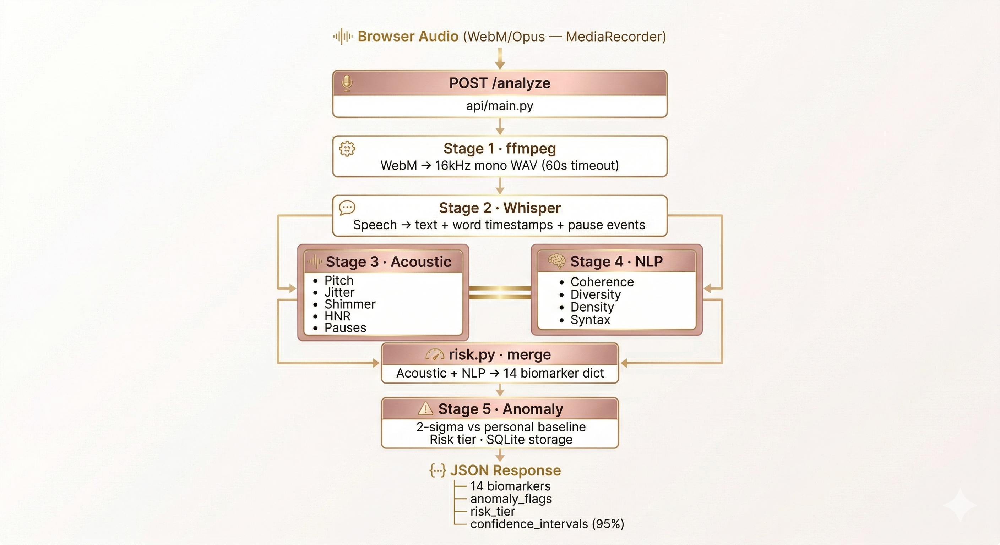

<div align="center">

<br/>


# 🧠 Neura Voice AI/ML Pipeline
### *5-stage voice analysis engine for cognitive health monitoring*

<br/>

[](https://python.org)
[](https://fastapi.tiangolo.com)
[](https://github.com/openai/whisper)
[](https://alamfarzann-cognisafe-ml.hf.space)
[](https://docker.com)
[](https://spacy.io)
[](https://sqlite.org)

<br/>

> 🔗 **Live API** → `https://alamfarzann-cognisafe-ml.hf.space`

<br/>

```
 Upload audio  →  5-stage pipeline  →  14 biomarkers + risk tier + anomaly flags + 95% CI
```

</div>

---

## 📖 Table of Contents

| Section | |
|---|---|
| [Overview](#-overview) | What this service does and how it's designed |
| [Pipeline Architecture](#-pipeline-architecture) | End-to-end data flow diagram |
| [Stage 1 — Audio Conversion](#-stage-1--audio-conversion-ffmpeg) | ffmpeg WebM → WAV |
| [Stage 2 — Whisper Transcription](#-stage-2--whisper-transcription) | STT + pause detection |
| [Stage 3 — Acoustic Features](#-stage-3--acoustic-feature-extraction) | librosa signal analysis |
| [Stage 4 — NLP Analysis](#-stage-4--nlp-analysis) | spaCy + MiniLM linguistics |
| [Stage 5 — Anomaly Detection](#-stage-5--anomaly-detection--risk-tier) | 2-sigma + risk tier |
| [The 14 Biomarkers](#-the-14-biomarkers) | Full reference table |
| [API Reference](#-api-reference) | `/analyze` `/compare` `/health` |
| [Database](#-database) | SQLite schema + session lifecycle |
| [Getting Started Locally](#-getting-started-locally) | Setup & run |
| [Deployment](#-deployment--huggingface-spaces) | Docker + HF Spaces |
| [Design Decisions](#-design-decisions) | Why X instead of Y |

---

## 🧠 Overview

The Neura Voice AI/ML pipeline is a **5-stage voice analysis engine** deployed as a FastAPI service on HuggingFace Spaces. It accepts a raw audio file from the browser, runs it through acoustic + linguistic analysis, and returns a complete cognitive health snapshot in a single JSON response.

| Property | Detail |
|---|---|
| 🐳 **Self-contained** | One Docker container, one command to start |
| 🛡️ **Fault-tolerant** | Every stage has a fallback — safe defaults instead of crashes |
| 💻 **CPU-only** | No GPU required, runs on any platform |
| 📈 **Personalized** | Longitudinal session history in SQLite — anomalies vs *your* baseline |

---

## 📁 Project Structure

```
cognisafe-deploy/
│
├── Dockerfile                  # Python 3.11-slim + ffmpeg + pip dependencies
├── requirements.txt
│
├── api/
│   └── main.py                 # FastAPI app — /analyze, /compare, /health
│
├── pipeline/
│   ├── acoustic.py             # librosa — 10 acoustic biomarkers
│   ├── transcription.py        # Whisper STT + pause detection
│   ├── nlp.py                  # spaCy + MiniLM — 4 linguistic biomarkers
│   ├── anomaly.py              # 2-sigma detection + risk tier + SQLite
│   └── risk.py                 # Merge acoustic + NLP → 14 biomarkers
│
└── data/
    └── sessions.db             # SQLite — per-user longitudinal history
```

---

## 🛠️ Tech Stack

| Tool | Role |
|---|---|
| **FastAPI + Uvicorn** | REST API server, async request handling |
| **OpenAI Whisper (base)** | Speech-to-text + word-level timestamps |
| **librosa** | Acoustic feature extraction — pitch, jitter, shimmer, HNR, pauses |
| **spaCy `en_core_web_sm`** | POS tagging, dependency parsing, sentence segmentation |
| **sentence-transformers `MiniLM-L6-v2`** | Sentence embeddings for semantic coherence |
| **scikit-learn** | Cosine similarity computation |
| **numpy / scipy** | Statistical analysis, signal processing |
| **soundfile** | Audio file I/O |
| **SQLite** | Lightweight longitudinal session storage |
| **ffmpeg** | Audio format conversion (WebM → WAV) |
| **Docker** | Containerization for HuggingFace Spaces |
| **python-multipart** | Multipart audio upload handling |

---

## 🏗️ Pipeline Architecture



## 🔄 Stage 1 — Audio Conversion (ffmpeg)

**File:** `api/main.py`

The browser's `MediaRecorder` produces **WebM/Opus**. All audio is normalised to **16kHz mono WAV** before further processing (Whisper's optimal format). Skipped entirely if input is already `.wav`.

```python
subprocess.run([
    'ffmpeg', '-y',
    '-i', raw_path,    # WebM / MP3 / M4A / OGG / FLAC
    '-ar', '16000',    # 16kHz — Whisper optimal
    '-ac', '1',        # mono
    '-f', 'wav',
    temp_path
], timeout=60)
```

**Supported formats:** `.wav` `.mp3` `.m4a` `.ogg` `.flac` `.webm` `.weba` `.opus`

---

## 🗣️ Stage 2 — Whisper Transcription

**File:** `pipeline/transcription.py`

**Whisper base** is loaded once at module startup. It runs in ~60–90 seconds on CPU for a 3-minute recording — the right tradeoff between speed and accuracy for biomarker extraction.

### Output structure

```python
{
    'text':         "In this picture I can see a peaceful park...",
    'words':        [
        { 'word': 'In',   'start': 0.0,  'end': 0.18 },
        { 'word': 'this', 'start': 0.18, 'end': 0.36 },
        ...
    ],
    'pause_events': [
        { 'after_word': 'park', 'before_word': 'the', 'duration': 0.42, 'start_time': 3.2 },
        ...
    ],
    'word_count':   219,
    'duration':     89.4
}
```

### Pause detection

A pause is any inter-word gap > **200ms**:

```python
for i in range(1, len(words)):
    gap = words[i]['start'] - words[i - 1]['end']
    if gap > 0.2:
        pause_events.append({ ... })
```

> **Fallback:** If Whisper fails (corrupt audio, too short, missing ffmpeg), `_fallback_transcript()` returns an empty structure — the pipeline continues with zeroed word-count metrics rather than crashing.

---

## 🎵 Stage 3 — Acoustic Feature Extraction

**File:** `pipeline/acoustic.py`

Extracts **10 acoustic biomarkers** via **librosa** — pure Python, no external binaries, works identically on Linux and Windows.

> **Note:** Local dev used openSMILE (eGeMAPS). Production uses librosa for Docker/HuggingFace compatibility.

### Pitch — probabilistic YIN

```python
f0, voiced_flag, _ = librosa.pyin(
    y,
    fmin=librosa.note_to_hz('C2'),   # ~65 Hz
    fmax=librosa.note_to_hz('C7')    # ~2093 Hz
)
voiced_f0   = f0[voiced_flag]
pitch_mean  = np.mean(voiced_f0)
pitch_range = np.ptp(voiced_f0)      # peak-to-peak range
```

### Jitter — cycle-to-cycle pitch variation

Elevated jitter → vocal cord irregularity.

```python
periods = 1.0 / (voiced_f0 + 1e-9)
jitter  = np.mean(np.abs(np.diff(periods))) / np.mean(periods)
```

### Shimmer — cycle-to-cycle amplitude variation

Elevated shimmer → breathiness.

```python
rms     = librosa.feature.rms(y=y)[0]
shimmer = np.mean(np.abs(np.diff(rms))) / (np.mean(rms) + 1e-9)
```

### HNR — harmonics-to-noise ratio

Lower HNR → hoarser voice quality.

```python
harmonics = librosa.effects.harmonic(y)
noise     = y - harmonics
hnr       = 10 * np.log10(np.sum(harmonics**2) / np.sum(noise**2))
```

### Pause & speech rate

```python
# Voice Activity Detection → non-silent intervals
intervals = librosa.effects.split(y, top_db=30)

# Pauses = gaps > 200ms between non-silent intervals
pauses = [gap for gap in gaps if gap > 0.2]

pause_frequency     = len(pauses) / (duration / 60)       # pauses per minute
pause_duration_mean = np.mean(pauses)                      # average pause length (s)
speech_rate         = (word_count / duration) * 60         # wpm — includes pauses
articulation_rate   = (word_count / speech_duration) * 60  # wpm — excludes pauses
filled_pause_rate   = count("uh", "um") / (duration / 60)  # from transcript
```

---

## 📝 Stage 4 — NLP Analysis

**File:** `pipeline/nlp.py`

Extracts **4 linguistic biomarkers** from the Whisper transcript. spaCy and MiniLM-L6-v2 are both loaded once at module startup.

### 1 · Lexical Diversity — MTLD

MTLD tracks how quickly the type-token ratio degrades as you read through the text. Higher = richer vocabulary.

```python
def mtld_pass(tokens, threshold=0.72):
    factor_count, token_count = 0, 0
    types = set()
    for token in tokens:
        token_count += 1
        types.add(token)
        ttr = len(types) / token_count
        if ttr <= threshold:
            factor_count += 1
            token_count, types = 0, set()
    factor_count += (1 - ttr) / (1 - threshold)  # partial factor
    return len(tokens) / factor_count

mtld = (mtld_pass(tokens) + mtld_pass(reversed(tokens))) / 2
```

> **Range:** 40–100+ healthy. Below 40 → repetitive speech.

### 2 · Semantic Coherence

Cosine similarity between consecutive sentence embeddings — measures sentence-to-sentence logical flow.

```python
sentences  = [sent.text for sent in doc.sents]
embeddings = EMBEDDER.encode(sentences)

similarities = [
    cosine_similarity(embeddings[i-1], embeddings[i])
    for i in range(1, len(embeddings))
]
semantic_coherence = np.mean(similarities)  # 0.0 → 1.0
```

> **Range:** 0.3–0.8 healthy. Below 0.3 → disjointed / tangential speech (early cognitive decline indicator).

### 3 · Idea Density

Propositions per word — how much information is packed into speech.

```python
proposition_pos   = {'VERB', 'ADJ', 'ADV', 'ADP'}
proposition_count = len([t for t in doc if t.pos_ in proposition_pos])
idea_density      = proposition_count / total_word_count   # 0.0 → 1.0
```

> **Range:** 0.3–0.6 healthy. Declining density → reduced cognitive load capacity.

### 4 · Syntactic Complexity

Mean depth of the spaCy dependency parse tree — measures sentence structural complexity.

```python
def get_depth(token, depth=0):
    children = list(token.children)
    if not children:
        return depth
    return max(get_depth(child, depth + 1) for child in children)

depths = [get_depth(root) for root in sentence_roots]
syntactic_complexity = np.mean(depths)   # typical: 2–8
```

> Declining complexity (simpler sentences) → reduced executive function.

---

## 🚨 Stage 5 — Anomaly Detection & Risk Tier

**File:** `pipeline/anomaly.py`

Rather than comparing against population averages, Neura Voice measures **personal deviation** — each session is compared against that user's own historical baseline, making it sensitive to *individual change* rather than flagging natural variation between people.

> ⚠️ Requires **≥ 3 past sessions** to compute a meaningful baseline. New users always receive `Green` with no `anomaly_flags` until 3 sessions are stored.

### 2-Sigma Detection

```python
for biomarker in BIOMARKERS:
    historical_values = [s[biomarker] for s in past_sessions]

    mean      = np.mean(historical_values)
    std       = np.std(historical_values)
    deviation = abs(current_value - mean) / std   # z-score

    if deviation >= 2.0:
        severity = (
            'severe'   if deviation >= 3.0 else
            'moderate' if deviation >= 2.5 else
            'mild'
        )
        anomaly_flags.append({
            'biomarker': biomarker,
            'severity':  severity,
            'current':   current_value,
            'baseline':  mean,
            'deviation': deviation
        })
```

### Risk Tier Rules

| Tier | Trigger |
|---|---|
| 🟢 **Green** | No anomaly flags |
| 🟡 **Yellow** | 2+ mild flags **or** 1 moderate flag |
| 🟠 **Orange** | 2+ moderate flags **or** 1 severe flag |
| 🔴 **Red** | 2+ severe flags **or** 3+ moderate flags |

### 95% Confidence Intervals

Per biomarker, per user — lets the frontend show where your current value sits relative to your personal normal band.

```python
intervals[biomarker] = {
    'mean':     np.mean(values),
    'std':      np.std(values),
    'lower_95': mean - 1.96 * std,
    'upper_95': mean + 1.96 * std,
}
```

---

## 📊 The 14 Biomarkers

### 🎙️ Acoustic (librosa) — Stage 3

| # | Biomarker | Computation | Normal Range |
|---|---|---|---|
| 1 | `speech_rate` | words / total duration × 60 | 100–180 wpm |
| 2 | `articulation_rate` | words / speech-only duration × 60 | 130–220 wpm |
| 3 | `pause_frequency` | pause count / minute | 5–30 /min |
| 4 | `pause_duration_mean` | mean gap > 200ms | 0.3–0.8 s |
| 5 | `filled_pause_rate` | uh/um count / minute | 0–5 /min |
| 6 | `pitch_mean` | pYIN mean F0, voiced frames | person-relative |
| 7 | `pitch_range` | peak-to-peak F0 | person-relative |
| 8 | `jitter` | mean abs Δ pitch periods / mean period | < 0.05 |
| 9 | `shimmer` | mean abs Δ RMS / mean RMS | < 0.15 |
| 10 | `HNR` | 10 × log₁₀(harmonic / noise power) | > 10 dB |

### 📝 Linguistic (spaCy + MiniLM) — Stage 4

| # | Biomarker | Computation | Normal Range |
|---|---|---|---|
| 11 | `lexical_diversity` | MTLD forward + backward avg | 40–100+ |
| 12 | `semantic_coherence` | mean cosine sim, consecutive sentences | 0.3–0.8 |
| 13 | `idea_density` | propositions / total words | 0.3–0.6 |
| 14 | `syntactic_complexity` | mean dependency parse tree depth | 2.0–8.0 |

---

## 📡 API Reference

**Base URL:** `https://alamfarzann-cognisafe-ml.hf.space`

---

### `GET /health`

Wake-up ping. Use before a session to warm up the HuggingFace Space.

```json
{
  "status": "ok",
  "service": "Neura Voice AI Pipeline",
  "timestamp": "2026-03-29T10:00:00.000000"
}
```

---

### `POST /analyze`

Runs the full 5-stage pipeline on an audio file.

**Request:** `multipart/form-data`

| Field | Type | Required | Description |
|---|---|---|---|
| `audio` | File | ✅ | WAV, MP3, M4A, WebM, OGG, FLAC, OPUS |
| `user_id` | string | ❌ | For longitudinal tracking (default: `"demo_user"`) |

**Response `200`:**

```json
{
  "session_id": "f47ac10b-58cc-4372-a567-0e02b2c3d479",
  "user_id": "42",
  "timestamp": "2026-03-29T10:30:00.123456",
  "processing_time_seconds": 74.2,
  "biomarkers": {
    "speech_rate":          146.99,
    "articulation_rate":    205.59,
    "pause_frequency":      26.85,
    "pause_duration_mean":  0.476,
    "filled_pause_rate":    0.0,
    "pitch_mean":           33.42,
    "pitch_range":          8.06,
    "jitter":               0.051739,
    "shimmer":              1.2724,
    "HNR":                  5.6108,
    "lexical_diversity":    178.52,
    "semantic_coherence":   0.3447,
    "idea_density":         0.4201,
    "syntactic_complexity": 5.077
  },
  "anomaly_flags": [
    {
      "biomarker": "semantic_coherence",
      "severity":  "mild",
      "current":   0.31,
      "baseline":  0.34,
      "deviation": 2.1
    }
  ],
  "risk_tier": "Yellow",
  "confidence_intervals": {
    "speech_rate": {
      "mean":     146.99,
      "std":      2.10,
      "lower_95": 142.87,
      "upper_95": 151.11
    }
  }
}
```

**Error codes:**

| Code | Reason |
|---|---|
| `400` | Unsupported audio format |
| `500` | Internal pipeline error |

---

### `POST /compare`

Diff two session objects — returns direction and magnitude of change per biomarker.

**Request:**
```json
{
  "session_a": { "biomarkers": { "speech_rate": 150.0 }, "timestamp": "..." },
  "session_b": { "biomarkers": { "speech_rate": 130.0 }, "timestamp": "..." }
}
```

**Response:**
```json
{
  "timestamp_a": "2026-02-01T...",
  "timestamp_b": "2026-03-29T...",
  "diff": {
    "speech_rate": {
      "session_a":  150.0,
      "session_b":  130.0,
      "change":     -20.0,
      "change_pct": -13.33,
      "direction":  "down"
    }
  }
}
```

---

## 🗄️ Database

**File:** `pipeline/anomaly.py` — Python built-in `sqlite3`

Local SQLite at `data/sessions.db` enables personalized anomaly detection by storing each user's session history.

### Schema

```sql
CREATE TABLE sessions (
    id            INTEGER PRIMARY KEY AUTOINCREMENT,
    user_id       TEXT    NOT NULL,
    timestamp     TEXT    NOT NULL,    -- ISO8601 UTC
    biomarkers    TEXT    NOT NULL,    -- JSON — 14 values
    risk_tier     TEXT    NOT NULL,    -- Green / Yellow / Orange / Red
    anomaly_flags TEXT    NOT NULL     -- JSON — flag objects
);
```

### Session lifecycle

```
1. load_sessions(user_id)        → read past sessions for baseline
2. detect_anomalies(...)         → compare current vs baseline
3. compute_risk_tier(flags)      → aggregate severity → tier
4. compute_confidence_intervals  → 95% CI per biomarker
5. save_session(...)             → write current session to DB
```

> ⚠️ **HuggingFace Spaces (free tier):** The filesystem is ephemeral — SQLite resets on Space restarts. The backend **PostgreSQL** database is the production source of truth. SQLite acts as a fast local cache for anomaly detection within the active deployment cycle.

---

## 🚀 Getting Started Locally

**Prerequisites:** Python 3.11+, ffmpeg in PATH

```bash
# Install ffmpeg (Windows)
winget install Gyan.FFmpeg       # or: choco install ffmpeg
```

### Setup

```bash
# 1. Clone & activate
cd cognisafe-deploy
python -m venv venv
source venv/bin/activate         # Windows: venv\Scripts\activate

# 2. Install dependencies
pip install -r requirements.txt
python -m spacy download en_core_web_sm

# 3. Start server
uvicorn api.main:app --host 0.0.0.0 --port 7860
#  → http://localhost:7860
```

### Test

```bash
# Health check
curl http://localhost:7860/health

# Analyze audio
curl -X POST http://localhost:7860/analyze \
  -F "audio=@path/to/test_audio.wav" \
  -F "user_id=test_user"
```

### API Docs

```
http://localhost:7860/docs     ← Swagger UI
http://localhost:7860/redoc    ← ReDoc
```

---

## 🐳 Deployment — HuggingFace Spaces

The pipeline is containerized and deployed on **HuggingFace Spaces** (Docker SDK).

### Dockerfile

```dockerfile
FROM python:3.11-slim
WORKDIR /app

RUN apt-get update && apt-get install -y ffmpeg git \
    && rm -rf /var/lib/apt/lists/*

COPY . .
RUN pip install --no-cache-dir -r requirements.txt
RUN python -m spacy download en_core_web_sm
RUN mkdir -p data

EXPOSE 7860
CMD ["uvicorn", "api.main:app", "--host", "0.0.0.0", "--port", "7860"]
```

### HF Space config

```yaml
title: Neura Voice ML
emoji: 🧠
colorFrom: blue
colorTo: green
sdk: docker
pinned: false
```

### Cold start behaviour

HF free tier Spaces sleep after ~15 min of inactivity. On wake:

| Component | Load time |
|---|---|
| Docker container | ~5 s |
| Whisper base model | ~5–10 s |
| spaCy + MiniLM | ~10–15 s |
| **Total cold start** | **~60–90 s** |

The frontend handles this with health pings on load (`App.jsx`, `Session.jsx`) and a **480-second** request timeout (`sessionService.js`).

**Redeploy:** push to the HF Space repo → auto-rebuild.

---

## 🧩 Design Decisions

| Decision | Rationale |
|---|---|
| **librosa over openSMILE** | Pure Python pip install — no binary config needed for Docker/Linux. Covers all required biomarkers with comparable accuracy. |
| **Whisper base over large** | 140 MB vs 3 GB. ~90s vs ~10 min on CPU. Base quality is sufficient for biomarker extraction; word timestamps are reliable. |
| **SQLite over PostgreSQL** | Zero config inside Docker. Backend PostgreSQL is production source of truth — SQLite is a fast local cache for in-session anomaly detection. |
| **Frontend calls HF directly** | Render free tier has a 30s request timeout; ML processing takes ~90s. Frontend calls HF directly, then saves results to backend separately. |
| **Personalized baseline over population norms** | Biomarkers vary enormously between individuals. Comparing against *your own* history detects meaningful personal change rather than flagging normal individual variation. Requires 3+ sessions to activate. |

---

<div align="center">

<br/>

**Neura Voice AI/ML Pipeline** — Built by **Yash Raj Sharan** 🤖

*Part of the Neura Voice cognitive health monitoring platform.*

<br/>

[](https://alamfarzann-cognisafe-ml.hf.space/health)

<br/>

</div>
