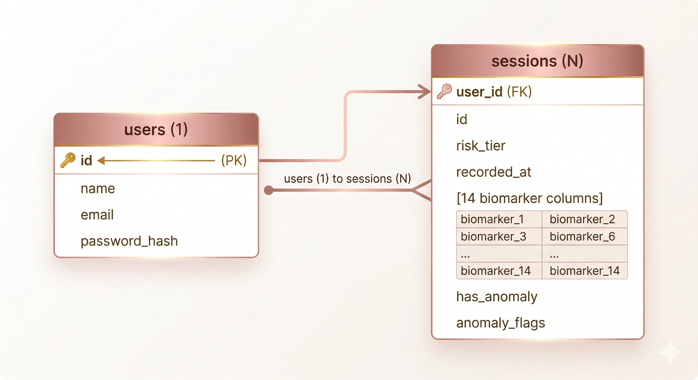

<div align="center">


# ⚙️ Neura Voice Backend
### *The nervous system of cognitive health monitoring.*

[](https://fastapi.tiangolo.com)
[](https://python.org)
[](https://postgresql.org)
[](https://jwt.io)
[](../LICENSE)

</div>

---

## 📖 Contents

[Overview](#-overview) · [Structure](#-project-structure) · [Tech Stack](#-tech-stack) · [Database Schema](#️-database-schema) · [API Reference](#-api-reference) · [Authentication](#-authentication) · [Getting Started](#-getting-started) · [Demo Seeding](#-demo-data-seeding) · [ML Integration](#-ml-pipeline-integration)

---

## 🧠 Overview

A **FastAPI REST API** — the connective layer between the React frontend and the AI/ML pipeline.

| Responsibility | Detail |
|---|---|
| 🔐 **Auth** | JWT register/login, bcrypt password hashing |
| 💾 **Session storage** | Persists all 14 biomarkers per session in PostgreSQL |
| 📊 **Trends & history** | Powers dashboard sparklines and calendar heatmap |
| 📄 **Weekly reports** | Computes narrative insights from biomarker averages |
| 📈 **Trajectory scoring** | Monthly cognitive pulse score (0–100) over time |
| 🤖 **ML proxy** | Optional fallback proxy to the HuggingFace ML service |

> Auto-generated docs at `http://localhost:8000/docs` (Swagger) and `/redoc`.

---

## 📁 Project Structure

```
neuravoice-backend/
├── main.py              # FastAPI entry point, CORS, startup hooks
├── database.py          # SQLAlchemy engine + session factory
├── auth.py              # Password hashing, JWT creation + decoding
├── dependencies.py      # get_current_user dependency injection
├── seed.py              # Demo data seeder (6 months of sessions)
├── requirements.txt
│
├── models/
│   ├── user.py          # User SQLAlchemy model
│   └── session.py       # Session model (14 biomarker columns)
│
├── schemas/
│   ├── auth.py          # RegisterRequest, LoginRequest, TokenResponse
│   ├── session.py       # SessionCreate, SessionResponse, HistoryItem
│   └── user.py          # UserResponse
│
└── routes/
    ├── auth.py          # POST /api/auth/register, /login
    ├── sessions.py      # POST/GET /api/sessions/*
    ├── reports.py       # GET /api/reports/weekly, /trajectory
    ├── users.py         # GET /api/users/me
    └── ml.py            # POST /api/ml/analyze, GET /api/ml/warmup
```

---

## 🛠️ Tech Stack

| Tool | Purpose |
|---|---|
| FastAPI | Async web framework, auto-docs |
| SQLAlchemy | ORM for PostgreSQL / SQLite |
| PostgreSQL | Production database |
| SQLite | Local dev fallback (zero config) |
| python-jose | JWT creation and decoding |
| passlib + bcrypt | Password hashing |
| httpx | Async HTTP client for ML proxy |
| Pydantic v2 | Request/response validation |
| Uvicorn | ASGI server |

---

## 🗄️ Database Schema

### `users`

| Column | Type | Notes |
|---|---|---|
| `id` | Integer PK | Auto-increment |
| `name` | String | Full name |
| `email` | String (unique) | Login email |
| `password_hash` | String | bcrypt hashed |
| `dob` | String | YYYY-MM-DD |
| `created_at` | DateTime | Auto-set |

### `sessions`

| Column | Type | Notes |
|---|---|---|
| `id` | Integer PK | Auto-increment |
| `user_id` | FK → users.id | Session owner |
| `risk_tier` | String | Green / Yellow / Orange / Red |
| `recorded_at` | DateTime | Session timestamp |
| `semantic_coherence` | Float | 0–1 |
| `lexical_diversity` | Float | MTLD score |
| `idea_density` | Float | 0–1 |
| `speech_rate` | Float | Words/min |
| `pause_frequency` | Float | Pauses/min |
| `pause_duration` | Float | Mean seconds |
| `pitch_mean` | Float | Hz |
| `pitch_range` | Float | Variability |
| `jitter` | Float | Cycle-to-cycle F0 |
| `shimmer` | Float | Amplitude variation |
| `hnr` | Float | Harmonics-to-noise ratio |
| `syntactic_complexity` | Float | Parse tree depth |
| `articulation_rate` | Float | WPM excl. pauses |
| `emotional_entropy` | Float | Emotional variability |
| `has_anomaly` | Boolean | Any biomarker flagged |
| `anomaly_flags` | String | JSON array of flag objects |

### ER Diagram



## 📡 API Reference

**Base URL:** `http://localhost:8000`

---

### 🔐 `/api/auth`

#### `POST /api/auth/register`
```json
// Request
{ "name": "Yash Raj Sharan", "email": "yash@example.com", "password": "pass123", "dob": "1968-05-14" }

// Response 200
{ "access_token": "eyJ...", "user_id": 1, "name": "Yash Raj Sharan", "email": "yash@example.com" }
// Error: 400 — Email already registered
```

#### `POST /api/auth/login`
```json
// Request
{ "email": "yash@example.com", "password": "pass123" }

// Response 200
{ "access_token": "eyJ...", "user_id": 1, "name": "Yash Raj Sharan", "email": "yash@example.com" }
// Error: 401 — Invalid credentials
```

---

### 🎙️ `/api/sessions`
> All routes require `Authorization: Bearer <token>`

#### `POST /api/sessions` — Save ML results
```json
// Request body: all 14 biomarkers + risk_tier + has_anomaly + anomaly_flags
// Response 200: saved session object with id + recorded_at
```

#### `GET /api/sessions/today`
```json
// Recorded:     { "recorded": true,  "risk_tier": "Green",  "session_id": 42 }
// Not recorded: { "recorded": false, "risk_tier": null,     "session_id": null }
```

#### `GET /api/sessions/latest`
```json
// Response 200: full session object with all 14 biomarkers
// Error: 404 — No sessions found
```

#### `GET /api/sessions/history?months=1`
```json
// Response 200 — array of:
{
  "date": "2026-03-29T10:30:00",
  "status": "good",          // "good" | "warn" | "bad"
  "risk_tier": "Green",
  "session_id": 42,
  "semantic_coherence": 0.34,
  "speech_rate": 146.99,
  "pause_frequency": 26.85
}
```

---

### 📄 `/api/reports`
> All routes require `Authorization: Bearer <token>`

#### `GET /api/reports/weekly`
```json
{
  "narrative": "This week you completed 5 sessions. Semantic coherence averaged 0.74...",
  "insights": [
    { "color": "success", "text": "Semantic coherence above your baseline." },
    { "color": "warn",    "text": "Pause frequency slightly elevated." },
    { "color": "indigo",  "text": "5/7 days recorded — great consistency." }
  ],
  "avg_semantic_coherence": 0.74,
  "avg_speech_rate": 142.3,
  "sessions_this_week": 5,
  "risk_tier": "Green"
}
```

**Insight color keys:** `success` = healthy · `warn` = monitor · `indigo` = informational

#### `GET /api/reports/trajectory?months=6`

**Scoring formula:**
```
score = (semantic_coherence × 40)
      + (min(speech_rate / 150 × 20, 20))
      + (max(0, 20 − pause_frequency × 3))
      + (min(hnr / 25 × 20, 20))
Range: 0–100
```

```json
// Response 200 — array of:
{ "month": "Oct", "score": 78.4, "session_count": 18 }
```

---

### 🤖 `/api/ml` — ML Proxy (fallback)

#### `POST /api/ml/analyze`
Proxies audio to HuggingFace. `multipart/form-data`: `audio` + `user_id`.
Errors: `504` timeout · `502` unreachable.

#### `GET /api/ml/warmup`
```json
// Warmed:   { "status": "warmed",  "hf": { "status": "ok" } }
// Warming:  { "status": "warming", "detail": "Connection timeout" }
```

---

### 🏥 Health

```
GET /health  →  { "status": "ok" }
GET /        →  { "status": "Neura Voice API running", "version": "1.0.0" }
```

---

## 🔐 Authentication

**JWT Bearer token** — all protected routes require `Authorization: Bearer <token>`.

| Setting | Value |
|---|---|
| Algorithm | `HS256` |
| Expiry | 10080 min (7 days) |
| Payload | `{ "sub": "<user_id>", "exp": <timestamp> }` |

```python
# Dependency used on all protected routes
def get_current_user(token = Depends(oauth2_scheme), db = Depends(get_db)) -> User:
    payload = decode_token(token)
    if not payload:
        raise HTTPException(401, "Invalid or expired token")
    return db.query(User).filter(User.id == int(payload["sub"])).first()
```

---

## 🚀 Getting Started

```bash
# 1. Install
cd neuravoice-backend && pip install -r requirements.txt

# 2. Environment
cp .env.example .env   # edit with your values

# 3. Run (SQLite — zero config locally)
uvicorn main:app --reload --port 8000
# Tables auto-created on startup + demo user seeded

# 4. Seed 6 months of demo data
python seed.py

# 5. Docs
open http://localhost:8000/docs    # Swagger UI
open http://localhost:8000/redoc   # ReDoc
```

---


## 🌱 Demo Data Seeding

`python seed.py` creates a realistic 6-month demo account:

| Field | Value |
|---|---|
| Name | Yash Raj Sharan |
| Email | `demo@neuravoice.app` |
| Password | `demo1234` |
| Sessions | ~130 over 6 months |

**Session arc** — designed to show cognitive drift on demo day:

```
Months 1–3  →  Stable Green  (healthy baseline)
Month 4     →  Yellow drift  (gradual decline)
Months 5–6  →  Mild decline  (some Orange sessions)
```

---

## 🤖 ML Pipeline Integration

The frontend calls HuggingFace **directly** to avoid Render's 30s timeout. The backend only receives the final results:

```
Frontend
  ├── POST https://alamfarzann-cognisafe-ml.hf.space/analyze
  │         (audio + user_id → 14 biomarkers + risk tier)
  │
  └── POST http://localhost:8000/api/sessions
            (saves ML results to PostgreSQL)
```

`/api/ml/analyze` exists as a fallback but is not used in production.

---

## 📦 Requirements

```
fastapi · uvicorn · sqlalchemy · psycopg2-binary
python-jose[cryptography] · passlib[bcrypt]
python-dotenv · python-multipart · httpx · pydantic
```

---

<div align="center">

Built with FastAPI ⚡ · Part of the Neura Voice platform

[](https://alamfarzann-cognisafe-ml.hf.space)
[](../README.md)

</div>
